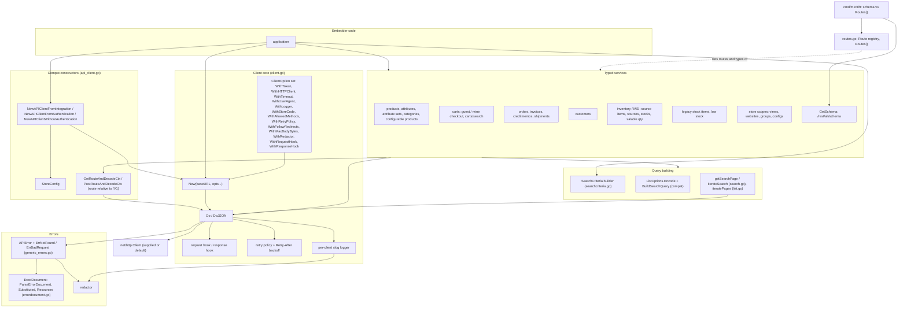
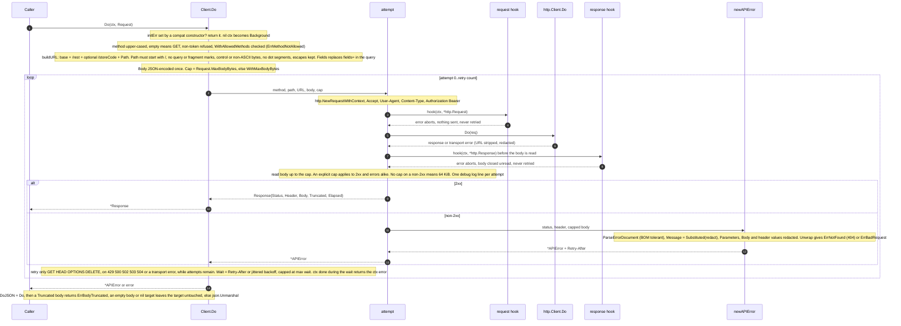
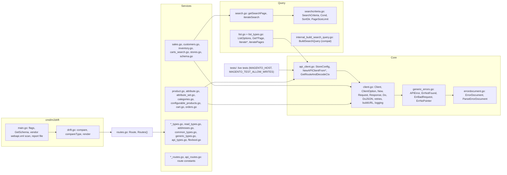

# go-m2rest architecture

go-m2rest is one Go package (`magento2`) over `net/http`, plus the `cmd/m2drift` tool. Everything
goes through `(*Client).Do`: the typed services build a `Request`, `Do` sends it, and errors come
back as `*APIError`. The diagrams below follow the code at v0.2.0.

## Layers

## One request through `Do`

## Files

| File | Holds |
|---|---|
| `client.go` | `Client`, `ClientOption` and every `With*`, `New`, `Request`, `Response`, `Do`, `DoJSON`, retry policy, URL building, per-attempt logging, `SetTimeout`, `SetRetryPolicy` |
| `generic_errors.go` | `APIError` (and building it from a response), `ErrNotFound`, `ErrBadRequest`, `ErrNoPointer` |
| `errordocument.go` | `ErrorDocument`, `ParseErrorDocument`, `Substituted`, `Resources`, capped placeholder substitution |
| `searchcriteria.go` | `SearchCriteria`, `Cond`, `SortDir`, `MinPageSize`, `MaxPageSize`, `PageSizeLimit` |
| `search.go` | getList paging over `SearchCriteria` (`getSearchPage`, `iterateSearch`, `iterateList`) |
| `list.go`, `list_types.go` | `ListOptions`, `GetProductsPage`, `IterateProducts`, attributes, attribute sets list, category tree, `iteratePages` |
| `internal_build_search_query.go` | `BuildSearchQuery`, `BuildFlexibleSearchQuery` (compat) |
| `routes.go` | `Route`, `Routes()`: every route the package calls, with its response type |
| `product.go`, `attribute.go`, `attribute_set.go`, `categories.go`, `configurable_products.go`, `cart.go`, `orders.go` | write and read helpers on `M*` wrappers (route constants in the matching `*_routes.go`) |
| `sales.go`, `customers.go`, `inventory.go`, `carts_search.go`, `stores.go`, `schema.go` | context-first read services and `GetSchema` |
| `*_types.go`, `read_types.go`, `addresses.go`, `common_types.go`, `generic_types.go`, `api_types.go`, `flexbool.go` | response and payload types, `FlexBool` |
| `api_client.go` | `StoreConfig`, `NewAPIClientFrom*`, `GetRouteAndDecode*`, `PostRouteAndDecode*` |
| `cmd/m2drift/main.go`, `cmd/m2drift/drift.go` | the drift check: fetch, compare, Markdown report, exit code |
| `tests/` | live tests against a disposable store |
